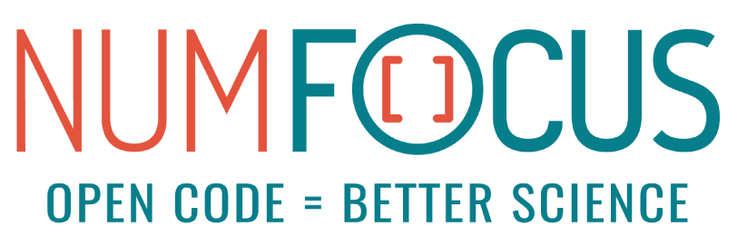

# Sponsors and institutional partners
## Institutional partners
:::::::{grid} 2
::::::{grid-item}
:columns: 12 12 6 6

::::{grid} 1 2 2 2
:::{include} cards/partner-logos.md
:::
::::
::::::

::::::{grid-item}
:columns: 12 12 6 6

**Details**

* Aalto University funds Osvaldo Martin to work on ArviZ thanks to the support of
  {abbr}`FCAI (Finnish Center for Artificial Intelligence)`
::::::
:::::::

## Sponsors
ArviZ currently has no Sponsors.
See the {ref}`gov_sponsors_partners` section in our governance for more information
on what Sponsors are and how to become one.

## Donate
:::{include} donate.md
:::

(historical_funding)=
## Historical funding
In the past, ArviZ has received institutional or financial support from:

* ArviZ was awarded a {abbr}`CZI (Chan Zuckerberg Initiative)` {abbr}`EOSS (Essential Open Source Software)`
  grant in 2021 in a joint application with PyMC and Stan. Dates: 2022-2024
* Helsinki University funded Oriol Abril Pla to work on ArviZ thanks to the support of
  {abbr}`FCAI (Finnish Center for Artificial Intelligence)`. Dates: 2021-2022
